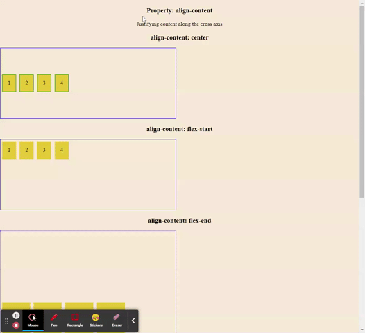
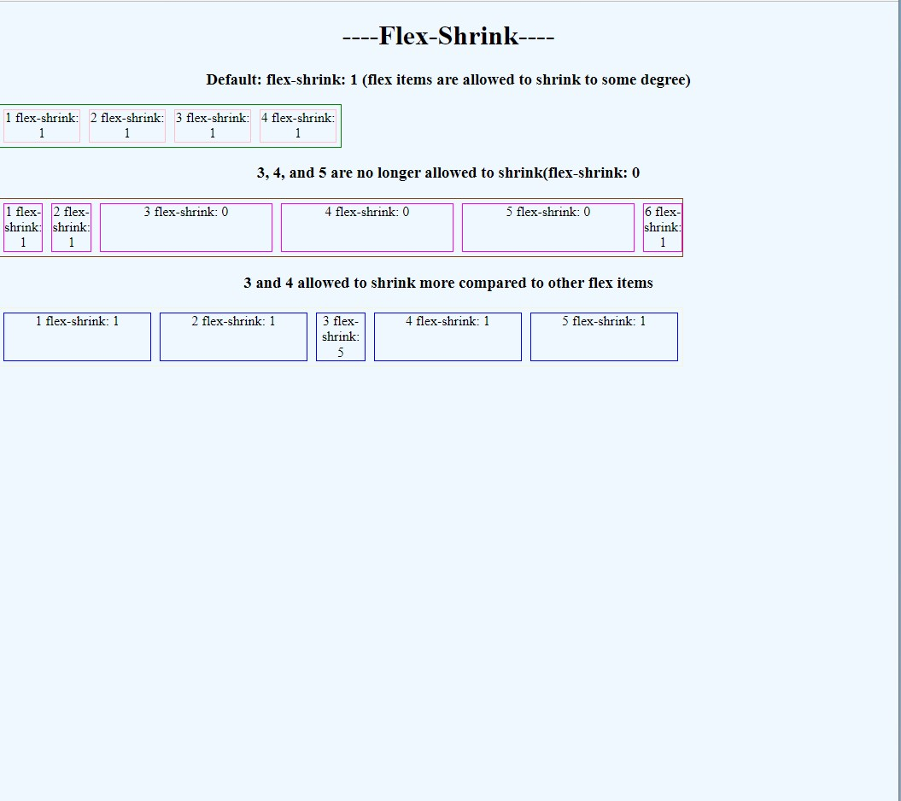

# Flexbox

## Description

Example of flexbox layout.

## Usage

### align-content

### align-items

### align-self

### flex-basis

### flex-direction/justify-content

### flex-grow

### flex-shrink

### flex-wrap

### grid

### grid-lorem

### media

### holygrail

